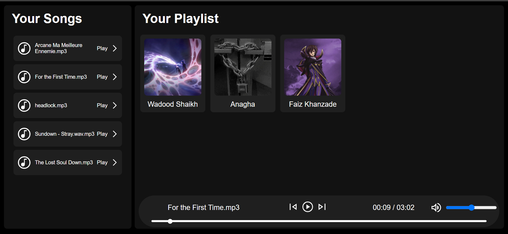

# 🎵 Web Music Player – HTML, CSS & JavaScript

A browser-based **music player** inspired by Spotify’s design, built using **HTML, CSS, and Vanilla JavaScript**.  
This app lets you choose different music folders, browse album covers, and play songs directly in your browser — no sign-up or backend required.

---

🔗 **Live Site:** [https://wadoodshaikh.github.io/webmusicplayer](https://wadoodshaikh.github.io/webmusicplayer)

---

## 📸 Preview

---

## ✨ Features

- ✅ Play music directly from folders in the repository  
- ✅ Play, pause, next, and previous track controls  
- ✅ Dynamic playlist generation using JavaScript  
- ✅ Album cover display for each folder  
- ✅ Responsive layout for desktop, tablet, and mobile  

---

## 🛠️ Tech Stack

- **HTML5**
- **CSS3** (Flexbox & CSS Grid)
- **JavaScript (ES6)**

---

## 📁 Folder Structure

web-music-player/ 
├── index.html 
├── css/ 
│ ├── style.css 
│ ├── utility.css 
│ └── responsive-style.css 
├── js/ 
│ └── script.js 
├── songs/ 
│ ├── Album1/ 
│ │ ├── song1.mp3 
│ │ ├── song2.mp3 
│ ├── Album2/ 
│ │ └── ... 
├── images/ 
│ ├── play.svg 
│ ├── pause.svg 
│ ├── next.svg 
│ └── ... 
├── README.md 

---

## 🧠 What I Learned

- Handling folder-based media content in JavaScript  
- Creating a responsive, browser-compatible audio player  
- Structuring a static music web app for GitHub Pages hosting  

---

## 💡 How to Use

1. Clone or download the repository.
2. Place your songs inside the `songs/` folder, organizing them by album or artist.
3. Open `index.html` in a browser — or view the hosted version.

---

## 📮 Feedback & Contributions

Found a bug or have an idea? Open an issue or submit a pull request.

---

👨‍💻 Created by **Michihiro**
